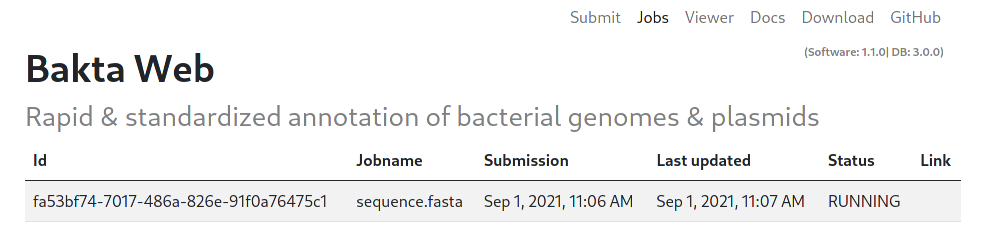

# Bakta Web-UI

Bakta contains a dedicated Web-Version available via <https://bakta.computational.bio>.

## Overview

The Bakta mainpage contains multiple sections for user input.
A textfield to paste your fasta sequence directly, as well as
a file input to upload your sequence directly via file.

The Bakta menu contains multiple subsections:

- Submit: The mainpage for submitting new Jobs
- Jobs: Overview of all submitted Jobs and their status
- Viewer: Visualizing feature for finished Jobs and locally computed results
- Docs: Link to this documentation
- Download: Links to download the Bakta tool and database
- GitHub: Link to the Github repo to contribute.

## Submit options

After choosing a sequence, users can set additional options before submitting.

The submit options are split in three sections. An `Organism` section that allows users to specify additional (optional) description tags for the submitted fasta sequence, an `Annotation` section that specifies the annotation settings and a `Replicons` section that specifies additional options regarding the actual sequence.

## Monitoring Jobs

Submitted jobs are monitored automatically in the `Jobs` tab.

All jobs start with the `INIT` status. This indicates an initializing status, as well as a waiting position in the queue. A running Job is indicated by the `RUNNING` status.

Finished jobs have the `SUCCESFULL` status and include a `LINK` to automatically show and visualize the results in the `Viewer` tab.

## Visualization

Results can be visualized via the `Viewer` tab, to visualize local files users can choose a local Json file for visualization. This visualization happens exclusively in the Browser, no data is uploaded to the Website.

### Results

Visualized results contain three sections:

- Job statistics: Contains a general overview of the Job and the achieved annotation.
- Genomeviewer: A IGV Genomebrowser to visualize the positions of features in the sequence.
- Annotations: List of all annotated features, including DB cross references to multiple common databases.

