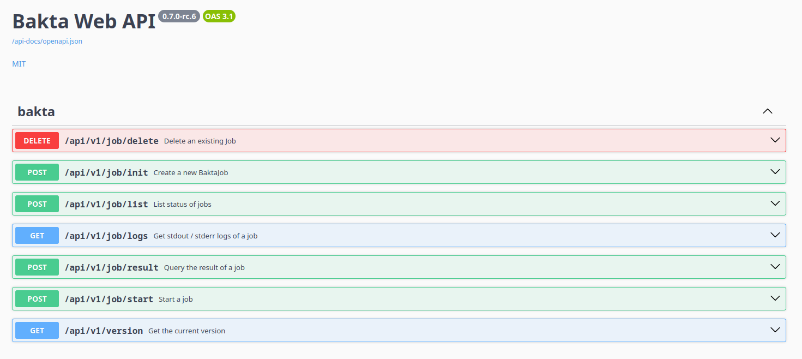

# Bakta API

Bakta provides a open-access REST-API that can be used to annotate own genomes programmatically. 

The API and the corresponding OpenAPI 3.1 documentation can be found here: 

<https://api.bakta.computational.bio>

The API provides the following endpoints:

- [Init Job](./init.md) - Initializes a new annotation job
- [Start Job](./start.md) - Start a previously initialized job
- [Delete Job](./delete.md) - Deleting an existing job

## Procedure

The overall procedure for jobs should look like this:

**Init** -> **Put Data** -> **Start** -> **List** (wait till job succeeeds) -> **Query Results**

A full roundtrip example can be found [here](./full.md).

## Bugs and Issues

If you find any bugs, issues please report them here:

**Bakta Web backend**: <https://github.com/ag-computational-bio/bakta-web-backend>