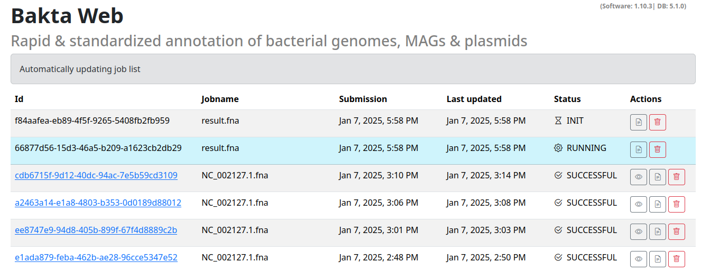

# Monitoring progress

All of your current and past jobs can be viewed in the **Jobs** tab.

This list automatically updated jobs that have not yet finished.

The list contains the following options:

- **Id**: The job UUID this can be used to uniquely identify your job.
- **Jobname**: A human readable name for your sequence / job. Based on your filename or `Manually_entered_sequence_s`/`Manually_entered_sequence` for manually entered sequences
- **Submission**: Timestamp of submission
- **Last updated**: When did this job receive the last update. Completed and failed jobs will not receive any updates.
- **Status**: The status of the job (INIT/RUNNING/SUCCESSFUL/ERROR).
- **Actions**: Actions for the specified jobs, view the stdout/stderr logs, permanently delete the job or view the results.

If the job was successful it will turn into a hyperlink to the result viewer section of this specific job.