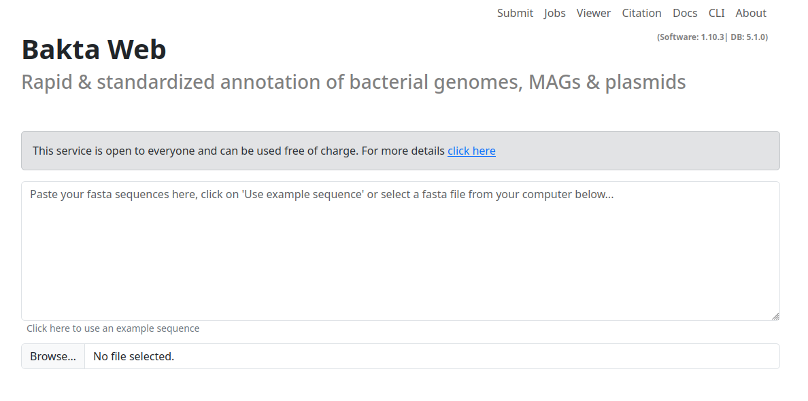

# Overview

The main page of Bakta Web is divided into multiple sections.
A textfield to paste your fasta sequence as well as
a file input to upload your sequence as a `fasta` file.

The menu contains multiple subsections:

- **Submit**: The main and landing for submitting new jobs
- **Jobs**: Overview of all submitted Jobs and their status
- **Viewer**: A dedicated viewer to visualize local Bakta results in the browser
- **Citation**: Citation information on how to properly cite the use of Bakta
- **Docs**: Link to this documentation
- **CLI**: Shortcut to the CLI repo and documentation 
- **About**: Legal information and terms of use, including a fair use policy.

