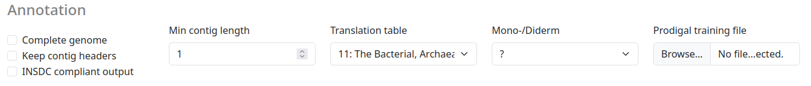

# Introduction

We provide a dedicated Bakta web version available via <https://bakta.computational.bio>.

## Overview

The main page of Bakta Web is divided into multiple sections.
A textfield to paste your fasta sequence as well as
a file input to upload your sequence as a `fasta` file.

The menu contains multiple subsections:

- **Submit**: The main and landing for submitting new jobs
- **Jobs**: Overview of all submitted Jobs and their status
- **Viewer**: A dedicated viewer to visualize local Bakta results in the browser
- **Citation**: Citation information on how to properly cite the use of Bakta
- **Docs**: Link to this documentation
- **CLI**: Shortcut to the CLI repo and documentation 
- **About**: Legal information and terms of use, including a fair use policy.

## Monitoring Jobs

Submitted jobs are monitored automatically in the `Jobs` tab.

All jobs start with the `INIT` status. This indicates an initializing status, as well as a waiting position in the queue. A running Job is indicated by the `RUNNING` status.

Finished jobs have the `SUCCESFULL` status and include a `LINK` to see the results in the `Viewer` tab.

## Visualization

Results can be visualized via the `Viewer` tab, to visualize local files users can choose a local Json file for visualization. This visualization happens entirely and exclusively in the Browser, no data is uploaded to the server.

### Results

Visualized results contain three sections:

- Job statistics: Contains a general overview of the annotated genome.
- Genomeviewer: An IGV-based genome browser to visualize annotated features.
- Annotations: A comprehensive list of all annotated features, including DB cross references to multiple common databases.

