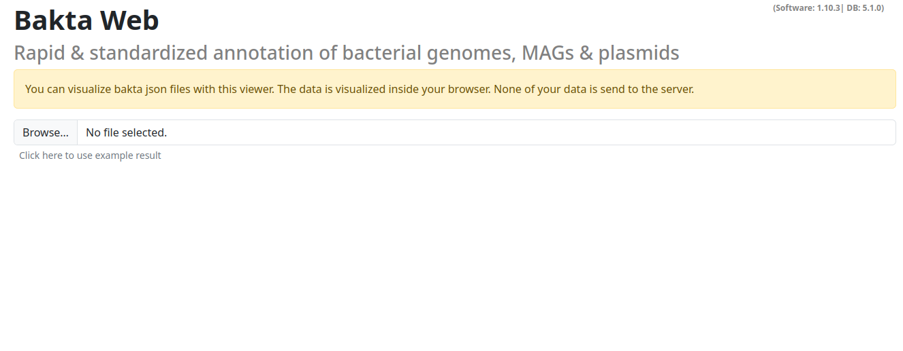
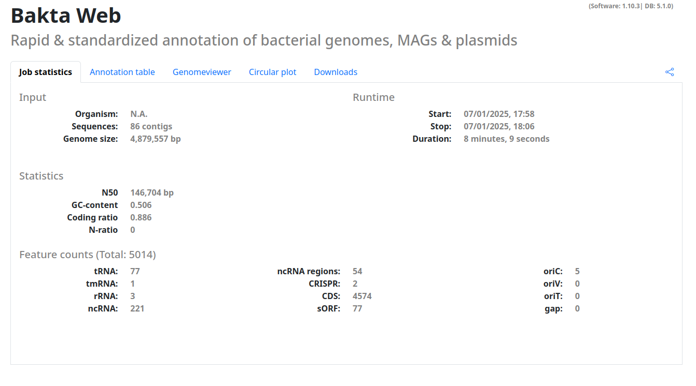
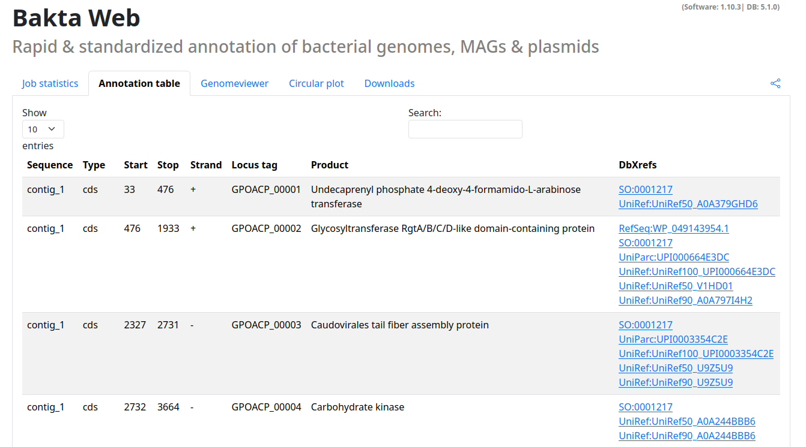
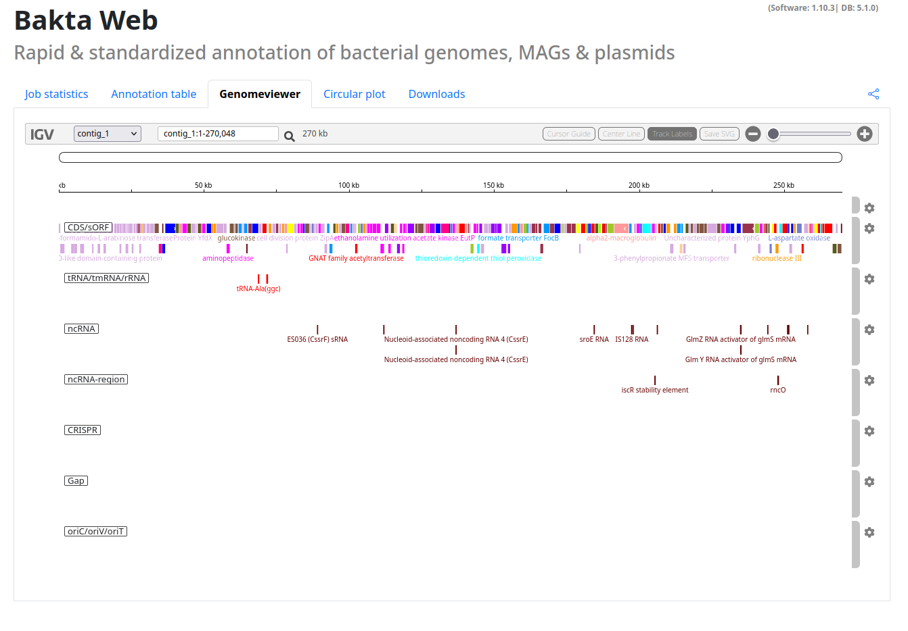
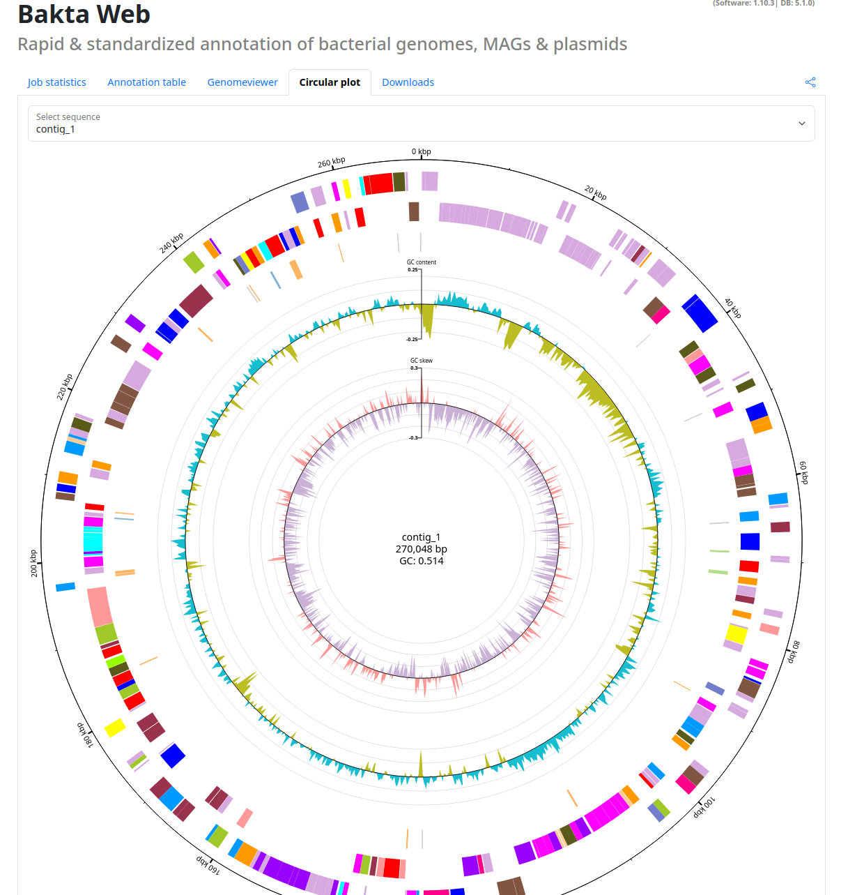
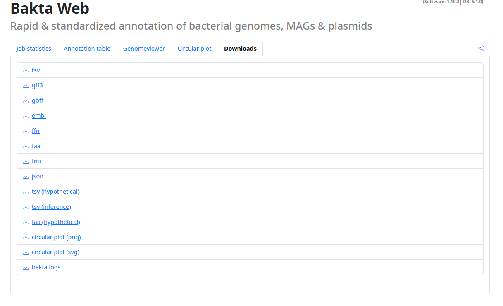

# Visualizing results

This page has two uses, you can either visualize a local `json` output from the Bakta CLI, or you can reach these page by clicking on your Successful **Bakta Web** results.

### Local results

You can select a local `json` file here. 

**NOTE**: This action does **NOT** upload any data, all visualizations are done in the browser on your local machine.

## Results section

When you correctly specified a result to visualize you will by directed to a page with your results.
This page is structured into multiple tabs with useful visualizations and information.

- **Job statistics**: Basic statistics of the job run (if available) and about your sequence, the number of annotated features etc.
- **Annotation table**: A searchable table of all annotated features including cross-references to all available databases
- **Genomeviewer**: An integrated IGV viewer to explore your annotated sequences.
- **Circular plot**: An interactive circular plot of your annotated sequences.
- **Downloads**: All Bakta output files as download for further processing.

Additionally this page contains a share button, with this you can share your annotation results to others.

**NOTE**: If you share the copied url you grant the recipient unrevokable access to this result.

## Examples

### Annotation table

### Genomeviewer

### Circular plot

### Downloads

