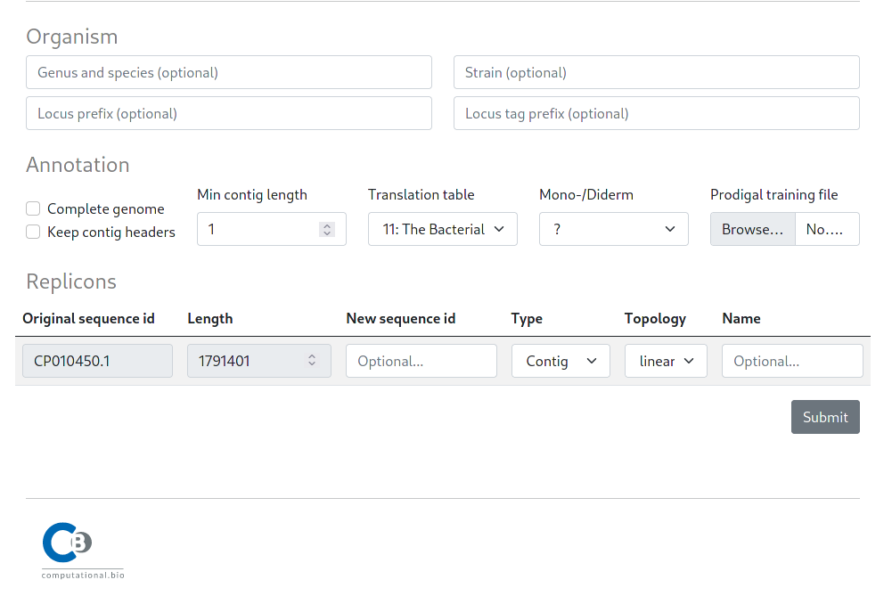

# Submitting a job

To annotate your sequence you must provide a valid sequence in fasta nucleotide format. This can either be done via the text input field or via the **Browse** file selector.

The submit options are split in three sections. An `Organism` section that allows users to specify additional (optional) description tags for the submitted fasta sequence, an `Annotation` section to specify the annotation settings and a `Replicons` section to provide optional sequence metadata, e.g. completeness and topology.
