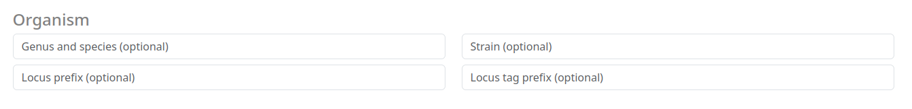
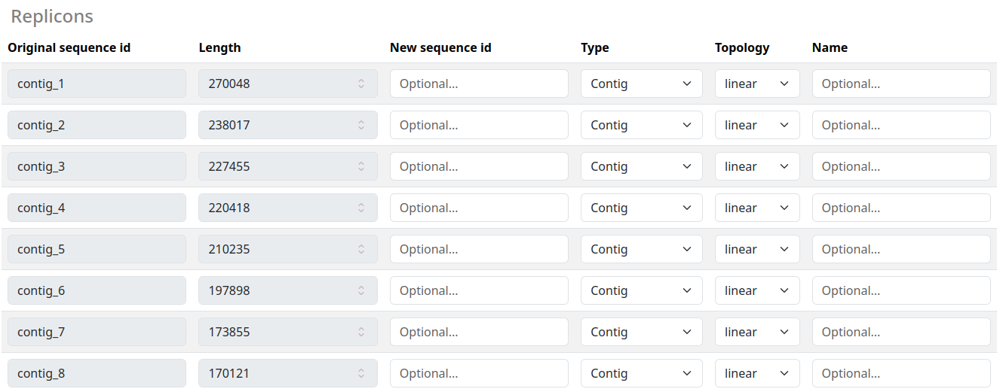

# Submitting a job

To begin the annotation process, submit your nucleotide sequence in **FASTA** format. You can paste the sequence directly into the text input field or upload a FASTA file using the **Browse** button. All sequences **MUST** be nucleotide sequences.

The submit options contain three sections. `Organism` for specifying additional (optional) description tags for the submitted organism, `Annotation` for annotation processing settings and `Replicons` to provide additional optional sequence metadata, e.g. completeness and topology for each provided contig.

## Organism

The **Organism** section contains descriptive fields for the organism being annotated. All fields are optional. The **Genus and Species** fields feature auto-completion, automatically querying a database of available organisms. The **Strain** field lets you specify a particular strain from the selected genus.

For sequence identification, **Locus prefix** and **Locus tag prefix** can be used to add prefixes to all sequences. This helps in organizing and identifying your sequences within the annotation results.

## Annotation

The **Annotation** section contains options that directly alter the annotation process, these options are the following:

- **Complete genome**: Flag to indicate that the sequence belongs to a complete genome and not a fragment
- **Keep contig headers**: Keep the original contig headers for the replicon table.
- **Min contig length**: The minimal contig length to consider for annotation
- **Translation table**: Which translation table should be used to identify Features
- **Mono-/Diderm**: Is your organism Mono or Diderm (or unknown)
- **Prodigal training file**: You can provide your own prodigal training file to customize your annotation process.

Most of these options are associated to a specific Bakta CLI option. More information about these settings can be found [here](../cli/usage.md).

## Replicons

The Replicons Table displays all sequences and their associated metadata in a visual format. Here you can provide additional information about each sequence, including new identifiers and alternative names.
Two critical settings in this section are Type and Topology:

- **Type**: Specify whether a sequence belongs to a chromosome or plasmid
- **Topology**: Indicate the sequence's topology

If you are uncertain about either the Type or Topology of a sequence, use ? to indicate unknown status. These settings help guide the annotation pipeline, but accuracy is more important than completeness - it's better to mark something as unknown than to provide incorrect information.
